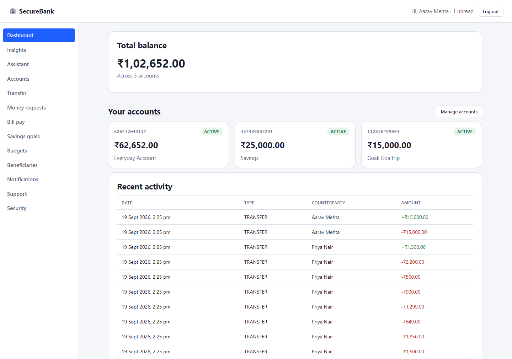
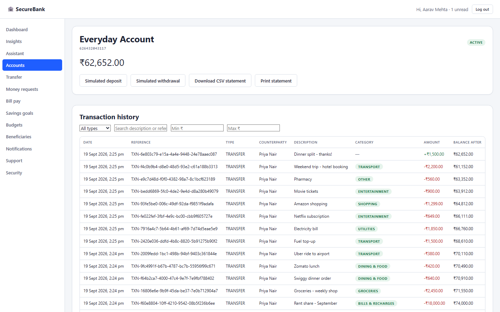
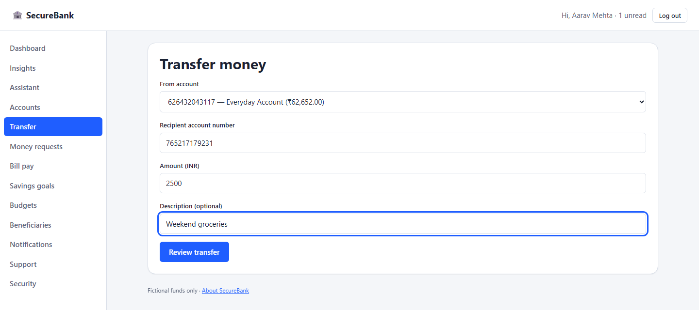
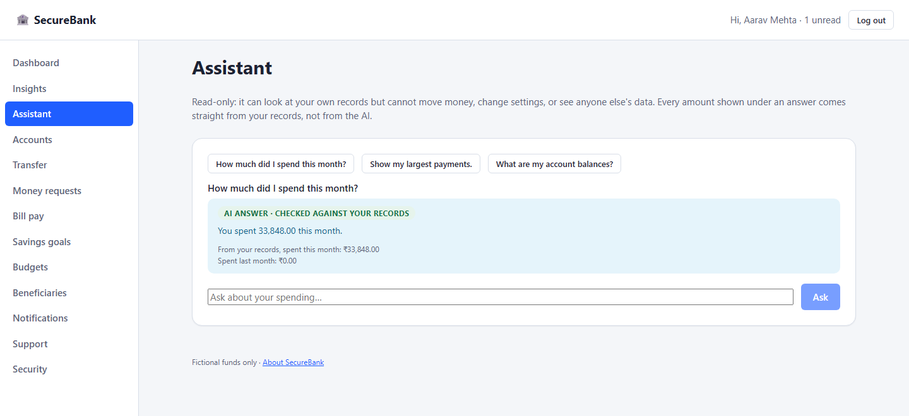
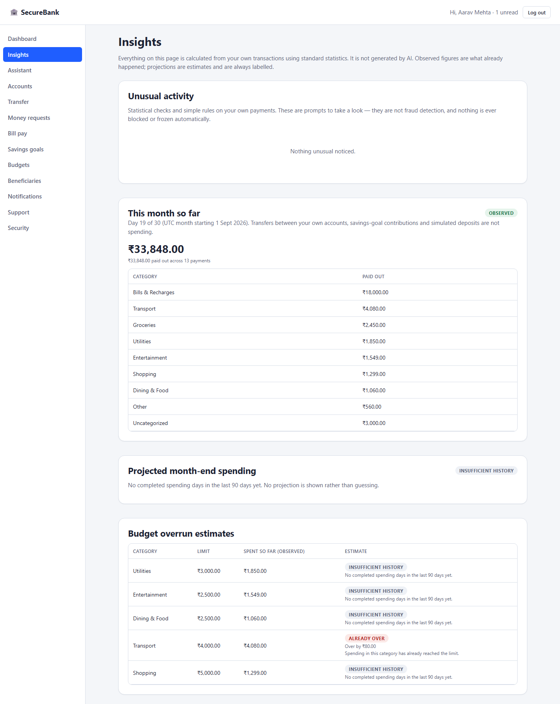
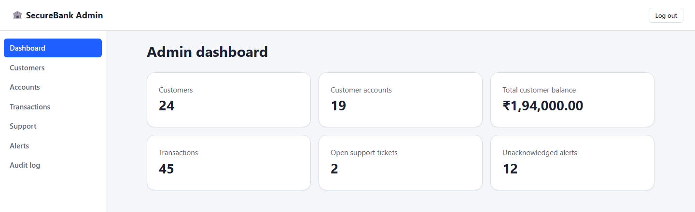

# SecureBank

A full-stack online banking simulator built with **Spring Boot, React, TypeScript, MySQL, Docker, SSE, and AI-assisted financial insights**.

SecureBank supports customer and admin workflows such as account management, transfers, statements, budgeting, savings goals, support, live notifications, and AI-powered spending assistance.

> **Demo only — all money and transactions are fictional.**

## Live Demo

https://securebank-app-k1a4.onrender.com

> Free-tier hosting may require a short cold start after inactivity.

---

## Key Features

### Customer

* Secure registration and login
* Multiple accounts
* Deposits, withdrawals, and transfers
* Beneficiaries and money requests
* Bill payments
* Transaction history and CSV statements
* Budgets and savings goals
* Spending insights and forecasts
* Live notifications
* Support tickets
* AI banking assistant
* Smart transaction categorization

### Admin

* Customer and account monitoring
* Transaction inspection
* Freeze / unfreeze accounts
* Activity alerts
* Support management
* Audit logs

---

## AI Features

SecureBank includes an optional Groq-powered assistant for questions such as:

* “How much did I spend this month?”
* “What were my largest expenses?”
* “What is my current balance?”

Financial values are calculated by the backend. AI is only used to phrase responses, and generated financial facts are validated against trusted user data.

The application also supports AI-assisted transaction categorization with a deterministic fallback when AI is unavailable.

---

## Real-Time Updates

SecureBank uses **Server-Sent Events (SSE)** to provide live updates for transfers and notifications.

When a transfer completes:

* balances are updated atomically,
* transaction history is stored,
* the recipient receives a live notification,
* the UI refreshes without manual reload.

---

## Screenshots

Captured from the live deployment at 1440×900 using fictional data only.

### Customer Dashboard



*Total balance, accounts (including a savings-goal pot) and recent activity at a glance.*

### Transactions



*Searchable, filterable account history with counterparties, categories, amounts and running balances.*

### Transfer Money



*Transfers are reviewed before sending and protected by database-backed idempotency.*

### AI Assistant



*A read-only assistant whose answers are checked against the customer's own backend-computed figures.*

### Spending Insights



*Observed spending, unusual-activity checks and budget estimates, with "insufficient history" shown instead of guessing.*

### Admin Dashboard



*Operational overview for administrators; admins can freeze accounts and answer support but never move money.*

---

## Tech Stack

**Frontend:** React, TypeScript, Vite, TanStack Query
**Backend:** Java, Spring Boot, Spring Security, Spring Data JPA
**Database:** MySQL, Flyway
**Real-time:** Server-Sent Events
**Testing:** JUnit, Testcontainers, Vitest, Playwright
**DevOps:** Docker, GitHub Actions, Render, Aiven
**AI:** Groq

---

## Security & Financial Design

* Server-side sessions and CSRF protection
* Secure password hashing
* Ownership and role-based authorization
* Atomic transfers
* Database-backed idempotency
* Pessimistic locking
* Append-only balanced ledger
* `BigDecimal` / MySQL `DECIMAL`
* TLS-secured database connections

---

## Architecture

```text
React + TypeScript
        │
    REST + SSE
        │
        ▼
   Spring Boot
        │
        ▼
      MySQL
```

More details: [`docs/architecture.md`](docs/architecture.md)

---

## Run Locally

```bash
cp .env.example .env
docker compose up --build
```

Open:

```text
http://localhost:8080
```

---

## Test Results

| Test             |   Result |
| ---------------- | -------: |
| Backend          |  110/110 |
| Frontend         |    38/38 |
| Playwright       |    23/23 |
| Public checks    |   Passed |
| CI               |   Passed |
| Groq integration | Verified |
| Persistence      | Verified |

Detailed verification: [`IMPLEMENTATION_STATUS.md`](IMPLEMENTATION_STATUS.md)

---

## Documentation

* [`docs/architecture.md`](docs/architecture.md)
* [`docs/deployment.md`](docs/deployment.md)
* [`docs/ai-features.md`](docs/ai-features.md)
* [`docs/backup-restore.md`](docs/backup-restore.md)

---

## Deployment

SecureBank is deployed using:

* **Render** — application
* **Aiven MySQL** — database
* **Groq** — AI
* **GitHub Actions** — CI

---

## Disclaimer

SecureBank is an educational portfolio project.

All accounts, balances, and transactions represent **fictional money** and must not be used for real banking activity.
